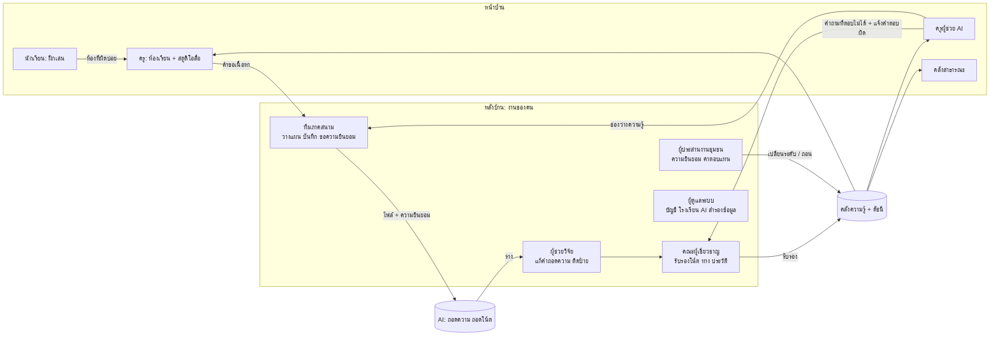

# ADR-0001: ระบบหลังบ้าน (Back Office) สำหรับงานที่ต้องใช้คน

**Status:** Accepted (ข้อ 1–4 ทำแล้ว 2026-10-07)
**Date:** 2026-10-07
**Deciders:** หัวหน้าโครงการ, หัวหน้าทีมภาคสนาม, ประธานคณะผู้เชี่ยวชาญ, ผู้ประสานงานชุมชน, ผู้ดูแลระบบ

## Context

หน้าบ้าน (นักเรียน ครู สาธารณะ) ทำงานได้แล้ว: ฝึกเล่นกับโค้ช AI, ครูผู้ช่วย AI, คลังความรู้, สตูดิโอสื่อ แต่คุณภาพของทุกอย่างที่หน้าบ้านแสดงขึ้นกับงานของคนที่อยู่หลังบ้าน ข้อมูลไหลแบบนี้:

### มีอยู่แล้วในต้นแบบ

| งาน | หน้า | สถานะ |
|---|---|---|
| สร้างรอบบันทึก, ความยินยอม, ป้าย TK, อัปโหลด, checklist | `/field` | ใช้ได้ |
| ถอดความสัมภาษณ์และถอดโน้ตด้วย AI | `/field` → คิว | ใช้ได้ |
| ตรวจรับรองรายชิ้น, ดูคำตอบ AI ที่ถูกแจ้งผิด | `/curate` | ใช้ได้ แต่ผู้ตรวจคนเดียว |
| เปลี่ยนระดับสิทธิ์ / ถอนความยินยอม, audit log | `/consent` | ใช้ได้ |
| แดชบอร์ดห้องเรียน, มอบหมายงาน | `/teach` | ใช้ได้ |

### ยังขาด (ต้องมีก่อนใช้กับข้อมูลจริง)

1. **บัญชีผู้ใช้จริง:** ตอนนี้เลือกบัญชีทดลอง ไม่มีรหัสผ่าน ไม่มีการเชิญ ไม่มีการผูกนักเรียนกับโรงเรียน
2. **การมอบหมายงานและติดตาม:** คิวตรวจรับรองไม่มีผู้รับผิดชอบ ไม่มีกำหนดเวลา ไม่มีการตรวจซ้ำโดยผู้เชี่ยวชาญคนที่สองตามที่แบบระบบกำหนด (κ ≥ 0.6)
3. **ทะเบียนคำศัพท์ควบคุม:** เพลง ทาง เครื่องดนตรี ผู้ให้ข้อมูล สร้างกระจัดกระจายระหว่างตรวจ ไม่มีที่รวม แก้ หรือรวมรายการซ้ำ
4. **ช่องว่างความรู้:** คำถามที่ครูผู้ช่วย AI ตอบไม่ได้ถูกเก็บแค่ใน audit log ไม่มีรายการให้ทีมภาคสนามนำไปวางแผน (ข้อความในหน้าเว็บสัญญาไว้ แต่ระบบยังไม่ทำจริง)
5. **ทะเบียนค่าตอบแทนและการแบ่งปันประโยชน์:** ไม่มีที่บันทึกการจ่ายค่าตอบแทนผู้ให้ข้อมูล
6. **ช่องทางรับคำขอจากชุมชน:** การถอนความยินยอมทำได้ในระบบ แต่คำขอส่วนใหญ่จะมาทางโทรศัพท์หรือพูดต่อหน้า ยังไม่มีบันทึกว่าใครขอ ใครยืนยัน
7. **รายงานตัวชี้วัด วช.:** ตัวเลข Output / Outcome กระจายอยู่หลายตาราง ไม่มีหน้าสรุปหรือส่งออก
8. **ดูแลระบบ AI และข้อมูล:** ไม่มีหน้าดูสถานะเซิร์ฟเวอร์ Unsloth, ไม่มีสำรองข้อมูลอัตโนมัติ, ไม่มีการส่งออกแพ็กเกจจดหมายเหตุ

### แรงกดดันที่ต้องคำนึง

- โครงการ 3 ปี ทีมเทคนิคเล็ก (น่าจะ 1–2 คน) ระบบต้องดูแลต่อได้หลังจบทุน
- ผู้ใช้หลังบ้านส่วนใหญ่ไม่ใช่คนไอที ครูภูมิปัญญาและผู้ประสานงานชุมชนบางคนใช้มือถืออย่างเดียว
- ความยินยอมต้องผูกกับดัชนี AI แบบทันที (ถอนแล้วหายจากครูผู้ช่วยภายใน 24 ชม.) จึงแยกระบบได้ยาก
- PDPA, จริยธรรมการวิจัยในมนุษย์, CARE/TK labels
- GPU มีชุดเดียว งาน AI ต้องเข้าคิว
- ต้องรายงาน วช. เป็นระยะด้วยตัวเลขที่ตรวจสอบย้อนได้

## Decision

**สร้างหลังบ้านเป็นพื้นที่ในแอปเดียวกัน (`/admin` และขยายหน้าที่มีอยู่) ใช้ฐานข้อมูลเดียวกัน จัดงานของคนทั้งหมดรอบ "คิวงานกลาง" ตารางเดียว** ใช้บริการภายนอกเฉพาะเรื่องที่ไม่ควรทำเอง คือการยืนยันตัวตน (SSO ของมหาวิทยาลัย หรือ Google Workspace for Education ของโรงเรียน) และการสำรองข้อมูลนอกสถานที่

### โครงสร้าง: คิวงานกลาง

ทุกงานที่ต้องใช้คนเป็นแถวในตาราง `tasks` เดียว ไม่ว่าจะมาจากหน้าไหน

| ฟิลด์ | ความหมาย |
|---|---|
| `type` | `review_notation`, `review_transcript`, `second_review`, `tutor_flag`, `knowledge_gap`, `consent_request`, `vocab_merge`, `media_check`, `school_onboard` |
| `subject` | อ้างถึงแถวต้นทาง เช่น `segment:42`, `flag:7`, `consent:3` |
| `assignee_id`, `role` | มอบให้คนหรือให้ทั้งบทบาท |
| `status` | `open` → `in_progress` → `done` / `rejected`, มี `due_on` |
| `created_by` | คนหรือระบบ (เช่น AI ถอดความเสร็จแล้วสร้างงาน `review_transcript`) |

ข้อดีคือหน้า "งานของฉัน" หน้าเดียวใช้ได้กับทุกบทบาท, วัดภาระงานและเวลาค้างได้ทันที และตัวเลขรายงาน วช. ดึงจากตารางเดียว

### โมดูลหลังบ้าน

| โมดูล | ผู้ใช้หลัก | ทำอะไร | ส่งอะไรกลับไปหน้าบ้าน |
|---|---|---|---|
| 1. งานของฉัน | ทุกบทบาทหลังบ้าน | กล่องงานรวม, กำหนดส่ง, มอบต่อ | – |
| 2. แผนภาคสนาม | ทีมภาคสนาม | ปฏิทินลงพื้นที่, รายการช่องว่างความรู้ (จากคำถามที่ AI ตอบไม่ได้และคำขอครู), ทะเบียนผู้ให้ข้อมูล | เนื้อหาใหม่เข้าคลัง |
| 3. ตรวจรับรองสองชั้น | ผู้ช่วยวิจัย → ผู้เชี่ยวชาญ | ผู้ช่วยวิจัยแก้ร่าง AI, ผู้เชี่ยวชาญรับรอง, สุ่มตรวจซ้ำคนที่สองและคำนวณ κ | ความรู้ที่รับรองเข้าดัชนี AI |
| 4. ทะเบียนคำศัพท์ | ผู้เชี่ยวชาญ | เพลง ทาง เครื่องดนตรี บุคคล, รวมรายการซ้ำ, ชื่อเรียกอื่น (ไทย/ลาว/อีสาน) | ค้นหาและครูผู้ช่วยตอบตรงขึ้น |
| 5. ชุมชนและความยินยอม | ผู้ประสานงานชุมชน | บันทึกคำขอที่มาทางโทรศัพท์ (ใครขอ ใครยืนยัน), ค่าตอบแทน, หน้าผลงานของครูแต่ละท่าน | ระดับสิทธิ์และการถอนมีผลทันที |
| 6. โรงเรียนและบัญชี | ผู้ดูแลระบบ | เชิญครู, ผูกห้องเรียน, นำเข้ารายชื่อนักเรียน, ปิดบัญชี | บัญชีจริงแทนบัญชีทดลอง |
| 7. รายงานและดูแลระบบ | หัวหน้าโครงการ, ผู้ดูแลระบบ | ตัวชี้วัด วช. (ส่งออก CSV), สถานะ GPU และคิว AI, คุณภาพ AI (อัตราแก้คำถอดความ), สำรองข้อมูล, ส่งออกแพ็กเกจจดหมายเหตุ | – |

### บทบาทเพิ่ม

เพิ่มบทบาท `assistant` (ผู้ช่วยวิจัย: แก้คำถอดความและติดป้าย แต่รับรองไม่ได้) และ `admin` (ผู้ดูแลระบบ) จากบทบาทเดิม 6 บทบาท

## Options Considered

### Option A: หลังบ้านอยู่ในแอปเดียวกัน (เลือก)

| Dimension | Assessment |
|---|---|
| Complexity | ปานกลาง: เพิ่มราว 10–15 หน้าและตาราง `tasks`, `vocab_aliases`, `payments`, `consent_requests` |
| Cost | ต่ำ: ไม่มีค่าไลเซนส์, เซิร์ฟเวอร์เดิม |
| Scalability | พอสำหรับเป้าหมายโครงการ (ผู้ใช้หลังบ้านไม่ถึง 50 คน, นักเรียนราว 1,500 คน) |
| Team familiarity | สูง: ภาษาและโครงสร้างเดียวกับหน้าบ้าน |

**Pros:** ความยินยอม การรับรอง และดัชนี AI อยู่ใน transaction เดียวกัน ถอนแล้วหายทันทีโดยไม่ต้อง sync ระหว่างระบบ, ทำหน้าจอภาษาไทย/ลาวและเหมาะกับมือถือได้ตามต้องการ, ดูแลโค้ดชุดเดียว
**Cons:** ต้องเขียนเองทั้งหมด (ตาราง ฟอร์ม สิทธิ์), ไม่ได้ฟีเจอร์คลังจดหมายเหตุสำเร็จรูป เช่น workflow แปลงไฟล์ระยะยาว

### Option B: ใช้ระบบสำเร็จรูป Mukurtu CMS (คลังมรดกชนพื้นเมือง) + Label Studio (งานติดป้ายเสียง)

| Dimension | Assessment |
|---|---|
| Complexity | สูง: สามระบบ (Mukurtu บน Drupal/PHP, Label Studio บน Python, แอปหน้าบ้าน) ต้อง sync กัน |
| Cost | ไลเซนส์ฟรี แต่ต้องมีคนดูแล Drupal |
| Scalability | ดี |
| Team familiarity | ต่ำ ถ้าทีมไม่เคยใช้ Drupal |

**Pros:** Mukurtu ออกแบบมาสำหรับ cultural protocols และ TK labels โดยตรง เป็นที่รู้จักในวงการคลังมรดก (ช่วยเรื่องความน่าเชื่อถือในข้อเสนอ), Label Studio มีหน้าตรวจเสียงและข้อความที่พร้อมใช้
**Cons:** ความยินยอมอยู่ใน Mukurtu แต่ดัชนี AI อยู่ในแอป: การถอนต้องผ่าน sync ที่อาจล่าช้าหรือพลาด ซึ่งเป็นความเสี่ยงด้านจริยธรรมโดยตรง, หน้าจอไทย/ลาวต้องแปลเอง, ผู้ใช้ต้องจำหลายระบบ, ภาระดูแลสูงหลังจบทุน

### Option C: Headless CMS (เช่น Directus) ครอบฐานข้อมูลเดียวกัน

| Dimension | Assessment |
|---|---|
| Complexity | ต่ำถึงปานกลาง: ได้หน้าจัดการตารางทันที |
| Cost | ฟรีสำหรับใช้เอง (ตรวจเงื่อนไขไลเซนส์ตามขนาดองค์กร) |
| Scalability | ดี |
| Team familiarity | ปานกลาง |

**Pros:** ทะเบียนคำศัพท์ บัญชีผู้ใช้ และตารางทั่วไปได้หน้าจัดการโดยไม่ต้องเขียน
**Cons:** แก้ข้อมูลตรงในตารางโดยไม่ผ่านกฎของแอป (เช่น เปลี่ยนระดับสิทธิ์โดยไม่สร้างดัชนีใหม่) ต้องปิดสิทธิ์ตารางสำคัญหลายตาราง, ต้องเปลี่ยนจาก SQLite เป็น PostgreSQL ก่อน, หน้าจอเป็นแบบ "ตาราง" ไม่เหมาะกับผู้ประสานงานชุมชน

## Trade-off Analysis

ประเด็นที่ตัดสินคือ **ความยินยอมต้องมีผลกับดัชนี AI ทันทีและตรวจสอบได้** ตัวเลือก B และ C ทำให้มีทางที่ข้อมูลจะเปลี่ยนโดยไม่ผ่านกฎนี้ ในโครงการที่กรรมการจะถามเรื่องจริยธรรมข้อมูลชุมชน ความเสี่ยงนี้หนักกว่าเวลาที่ประหยัดได้จากระบบสำเร็จรูป

ที่ A เสียไปคือเวลาเขียนหน้าจัดการทั่วไป ลดได้ด้วยการทำหน้าทะเบียนให้เรียบง่าย (ตาราง + ฟอร์ม) และใช้ SSO ภายนอกแทนการเขียนระบบรหัสผ่านเอง

ข้อดีของ B ที่ควรเก็บไว้: **ใช้มาตรฐานเดียวกับ Mukurtu** (TK labels, cultural protocols) และส่งออกข้อมูลในรูปแบบที่นำเข้า Mukurtu หรือคลังอื่นได้ เพื่อให้ย้ายไปได้ถ้าหน่วยงานที่รับดูแลต่อใช้ระบบนั้น

## ภาระงานคนโดยประมาณ (สำหรับตั้งงบบุคลากร)

ตั้งจากเป้าหมายในแบบระบบ (เสียง 300 ชม., ครูภูมิปัญญา 25 ท่าน, เพลง/ทาง 60 รายการ, โรงเรียน 30 แห่ง) **ตัวคูณทั้งหมดเป็นสมมติฐาน ต้องวัดจริงในรอบนำร่องปีที่ 1** แล้วปรับงบ

| งาน | สมมติฐาน | ชั่วโมงคน (3 ปี) | ผู้ทำ |
|---|---|---|---|
| ลงพื้นที่บันทึก | ~100 รอบ × 2 คน × 8 ชม. | ~1,600 | ทีมภาคสนาม |
| ขอความยินยอม + เอกสาร | ~100 รอบ × 1 ชม. | ~100 | ทีมภาคสนาม + ผู้ประสานงานชุมชน |
| แก้คำถอดความจาก AI | สัมภาษณ์ ~180 ชม. × 3–4 เท่าของความยาวเสียง (ภาษาถิ่นอาจสูงกว่า) | 540–720 | ผู้ช่วยวิจัย |
| ตรวจซ้ำคำถอดความ | สุ่ม 20% × 1.5 เท่า | ~55 | ผู้เชี่ยวชาญ |
| รับรองโน้ตและทาง | 60 รายการ × 1.5 ชม. × 2 คน | ~180 | ผู้เชี่ยวชาญ 2 ท่าน |
| ดูแลคำตอบ AI ที่ถูกแจ้ง + ช่องว่างความรู้ | 2 ชม./สัปดาห์ × 100 สัปดาห์ | ~200 | ผู้เชี่ยวชาญ |
| รับโรงเรียนเข้าระบบ + อบรมครู | 30 แห่ง × 6 ชม. + อบรม 60 คน | ~250 | ทีมการศึกษา |
| ดูแลระบบ | 4 ชม./สัปดาห์ | ~600 | ผู้ดูแลระบบ |

งานแก้คำถอดความเป็นงานคนที่ใหญ่ที่สุด และเป็นจุดที่ AI ลดภาระได้มากที่สุด (ถอดเองทั้งหมดใช้ราว 4–6 เท่าของความยาวเสียง) จึงควรวัด "อัตราที่ผู้ช่วยวิจัยต้องแก้" ตั้งแต่เดือนแรก ตัวเลขนี้ใช้ได้ทั้งตั้งงบและเป็นผลงานวิจัยด้าน ASR ภาษาถิ่น

## Consequences

**ง่ายขึ้น**
- ทุกคนเห็นงานของตัวเองในที่เดียว หัวหน้าโครงการเห็นงานค้างและคอขวดทันที
- รายงาน วช. ดึงจากระบบได้ ไม่ต้องรวบรวมด้วยมือ และตรวจย้อนถึงแถวต้นทางได้
- คำถามที่ครูผู้ช่วยตอบไม่ได้กลายเป็นแผนลงพื้นที่จริง ปิดวงจรตามแบบระบบ
- ความยินยอมยังมีผลทันทีเหมือนเดิม

**ยากขึ้น**
- ต้องเขียนและทดสอบหน้าหลังบ้านเพิ่มราว 10–15 หน้า
- ต้องย้ายจาก SQLite ไป PostgreSQL ก่อนเปิดให้ 30 โรงเรียนใช้พร้อมกัน (งานเขียนหลายคนพร้อมกันและการสำรองข้อมูลแบบต่อเนื่อง)
- ต้องเลือกและตั้งค่า SSO ร่วมกับหน่วยงานต้นสังกัด

**ต้องกลับมาทบทวน**
- ถ้าหน่วยงานที่รับดูแลต่อใช้ Mukurtu หรือ AtoM อยู่แล้ว: ทบทวนว่าจะย้ายคลังไปที่นั่นและเหลือแอปเป็นหน้าบ้านอย่างเดียวหรือไม่
- ถ้าอัตราแก้คำถอดความสูงกว่า 50%: พิจารณาปรับจูนโมเดลถอดเสียงด้วยคำถอดความที่รับรองแล้ว (ข้อมูลจากงานหลังบ้านเองคือข้อมูลฝึก)
- จำนวนผู้เชี่ยวชาญที่ตรวจซ้ำได้จริง ถ้ามีไม่ถึง 2 ท่านต่อสาย ต้องปรับเกณฑ์ตรวจซ้ำ

## Action Items

เรียงตามลำดับที่ควรทำ ข้อ 1–4 ควรเสร็จก่อนลงพื้นที่จริงรอบแรก

1. [x] เก็บคำถามที่ครูผู้ช่วย AI ตอบไม่ได้ลงตาราง `knowledge_gaps` รวมคำถามซ้ำ สร้างงานให้ทีมภาคสนาม หน้า `/gaps`
2. [x] ตาราง `tasks` + หน้า "งานของฉัน" (`/work`) + สร้างและปิดงานอัตโนมัติ (`lib/tasks.ts`)
3. [x] บทบาท `assistant` และขั้นตรวจสองชั้น เก็บร่าง AI ใน `segments.ai_draft` และวัด `edit_rate` เมื่อรับรอง
4. [x] คำขอจากชุมชนพร้อมหลักสองคน (`/consent/requests`) และทะเบียนค่าตอบแทน (`/consent/payments`)
5. [ ] SSO + เชิญบัญชี + ผูกโรงเรียน/ห้องเรียน แทนบัญชีทดลอง
6. [ ] ทะเบียนคำศัพท์ควบคุม (เพลง ทาง เครื่องดนตรี บุคคล) พร้อมรวมรายการซ้ำและชื่อเรียกหลายภาษา
7. [ ] การตรวจซ้ำคนที่สองแบบสุ่ม และคำนวณ Cohen's κ รายเดือน
8. [ ] หน้ารายงานตัวชี้วัด วช. + ส่งออก CSV
9. [ ] ย้ายฐานข้อมูลไป PostgreSQL, สำรองข้อมูล 3-2-1 อัตโนมัติ, ทดสอบกู้คืนรายไตรมาส
10. [ ] ส่งออกแพ็กเกจจดหมายเหตุ (ไฟล์ต้นฉบับ + metadata + ความยินยอม + TK labels) ในรูปแบบที่คลังอื่นนำเข้าได้
